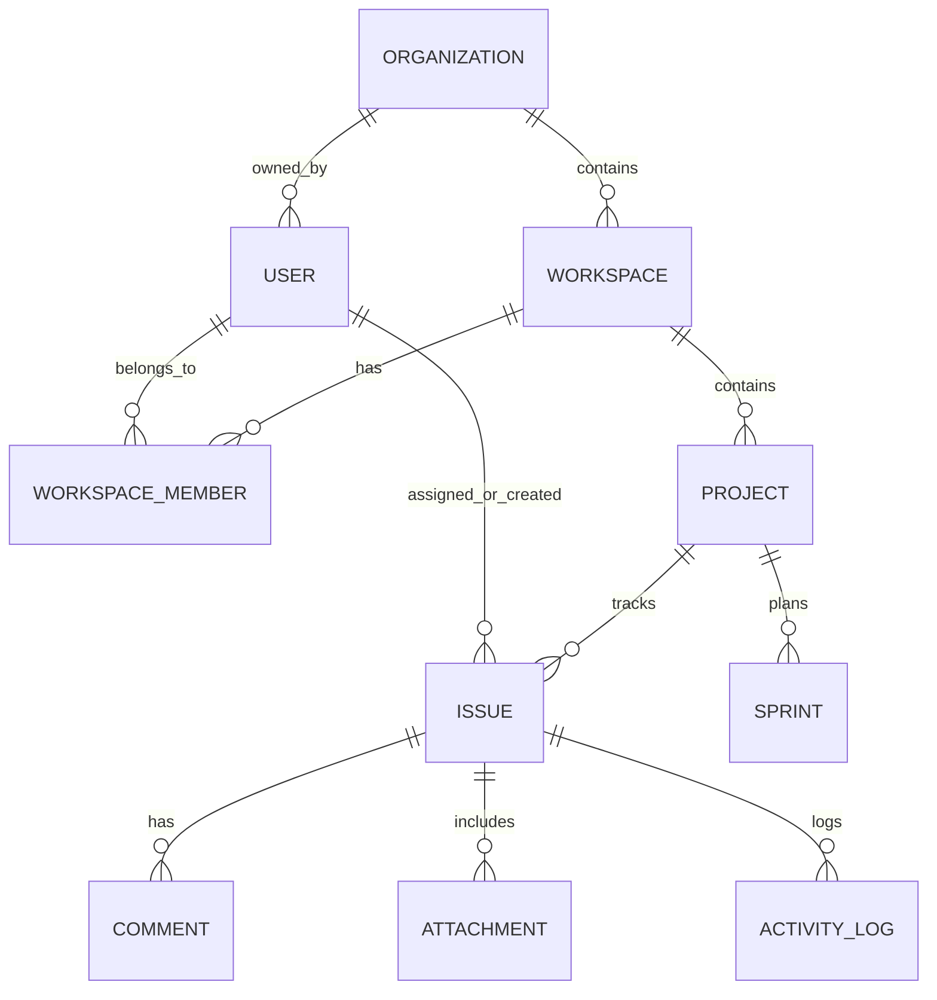

# Database Schema & Data Models

Workflow uses a normalized PostgreSQL relational schema managed via Prisma ORM ([`prisma/schema.prisma`](file:///home/nithin/Projects/workflow/prisma/schema.prisma)).

---

## 1. Entity-Relationship Model

---

## 2. Table Specifications

### Authentication Tables
* **`users`**: Primary identity table (`id`, `name`, `email`, `passwordHash`, `image`, `createdAt`, `updatedAt`).
* **`accounts`**: OAuth provider links (`provider`, `providerAccountId`, `refresh_token`, `access_token`, `expires_at`).
* **`sessions`**: Database session store (`sessionToken`, `userId`, `expires`).
* **`verification_tokens`**: Email verification / password reset tokens.

### Multi-Tenant Tables
* **`organizations`**: Top-level billing and governance boundary (`id`, `name`, `slug`, `ownerId`).
* **`workspaces`**: Team units within an organization (`id`, `organizationId`, `name`, `slug`, `description`).
* **`workspace_members`**: Membership join table with roles:
  * `OWNER` — Full control of workspace and billing.
  * `ADMIN` — Can create projects, invite members, and adjust settings.
  * `MEMBER` — Can create/update issues and comments.
  * `VIEWER` — Read-only observer.

### Projects & Issues Tables
* **`projects`**: Project definition (`id`, `workspaceId`, `name`, `key` e.g. `TRIP`, `color`, `issueSequence`, `leadId`).
* **`issues`**: Work items (`id`, `projectId`, `projectKey`, `issueNumber`, `title`, `description`, `status`, `priority`, `order`, `assigneeId`, `creatorId`, `sprintId`, `estimate`, `dueDate`).
  * `order`: Double precision float using fractional indexing for `0ms` drag-and-drop reordering.
* **`comments`**: Markdown discussions and threaded replies (`id`, `issueId`, `authorId`, `content`).
* **`attachments`**: Files and screenshot attachments (`id`, `issueId`, `fileName`, `fileSize`, `fileType`, `fileUrl`, `uploaderId`).
* **`activity_logs`**: Immutable audit trail (`id`, `workspaceId`, `issueId`, `actorId`, `action`, `details` JSON).
* **`notifications`**: User in-app notifications (`id`, `userId`, `title`, `message`, `link`, `isRead`).

---

## 3. Database Client Singleton

Located at [`src/lib/db/prisma.ts`](file:///home/nithin/Projects/workflow/src/lib/db/prisma.ts). In development mode, the client is attached to `globalThis` to prevent connection exhaustion during Next.js Hot Module Reloads.
